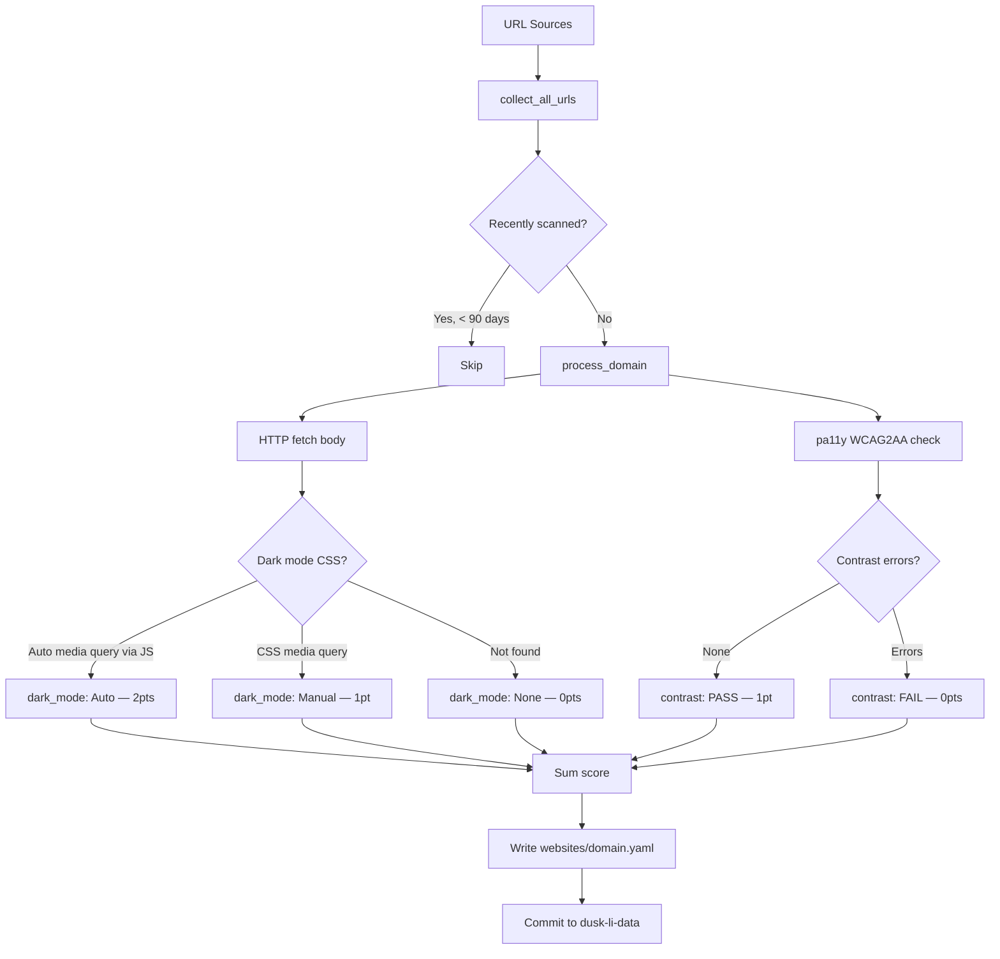

# a-scanner-duskli

Automated accessibility scanner for [dusk.li](https://dusk.li) — a directory that rates websites on their **dark mode support** and **colour contrast accessibility**.

## Overview

`a-scanner-duskli` fetches URLs from multiple sources, checks each site for dark mode CSS patterns and WCAG2AA colour contrast compliance (via [pa11y](https://pa11y.org/)), and writes the results as YAML files into the [dusk-li-data](https://github.com/dusk-li/dusk-li-data) repository. Three GitHub Actions workflows automate this on a nightly schedule, on a stale-site rescan, and in response to user-submitted review requests.

## How it works



### Scoring

| Criterion | Value | Points |
|-----------|-------|--------|
| Dark mode | `Auto` (JS `matchMedia`) | 2 |
| Dark mode | `Manual` (CSS `@media prefers-color-scheme`) | 1 |
| Dark mode | `None` | 0 |
| Contrast | `PASS` (zero WCAG2AA errors) | 1 |
| Contrast | `FAIL` or `BLOCKED` | 0 |
| **Maximum** | | **3** |

### Output format

Each scanned domain produces one YAML file at `websites/<domain>.yaml`:

```yaml
---
url: https://example.com
dark_mode: Auto          # None | Manual | Auto
contrast_accessibility: PASS  # PASS | FAIL | BLOCKED
accessibility_rating: 3/3
last_updated: 2024-03-15
```

`BLOCKED` means pa11y encountered a technical error (e.g. the site blocked the headless browser) and is scored as `FAIL`.

## URL Sources

The scanner aggregates URLs from four sources and deduplicates by domain:

| Source | Description |
|--------|-------------|
| `scripts/input/input.txt` | Static curated list committed to this repo |
| `dusk-li-data/websites/*.yaml` | All domains already in the catalogue (candidates for rescan) |
| [Tranco Top-1M](https://tranco-list.eu/) | Top 50000 domains (fetched at runtime) |
| [Majestic Million](https://majestic.com/reports/majestic-million) | Top 50000 domains (fetched at runtime) |

Domains scanned within the last **90 days** are skipped automatically (configurable via `RESCAN_AFTER_DAYS` in `scanner.py`).

## Repository structure

```
a-scanner-duskli/
├── .github/
│   ├── ISSUE_TEMPLATE/
│   │   └── review-request.yml   # GitHub Issue form for site review requests
│   └── workflows/
│       ├── nightly-scan.yml     # Runs daily at 02:00 UTC
│       ├── rescan-stale.yml     # Runs daily at 03:00 UTC, rescans old entries
│       └── on-review-request.yml # Triggered by review-request issues
├── docker/
│   └── duskli.dockerfile        # Docker image (Selenium + Chrome + Python)
├── scripts/
│   ├── scanner.py               # Main entry point
│   ├── core_functions.py        # check_contrast(), fetch_urls_from_*()
│   ├── core_modules.py          # Shared imports
│   ├── requirements.txt         # Python dependencies
│   ├── input/
│   │   └── input.txt            # Static curated URL list
│   └── json/
│       └── banned_sites.json    # Content categories excluded from scanning
└── README.md
```

## GitHub Actions workflows

### `nightly-scan.yml` — Daily broad scan

- **Trigger:** `cron: '0 2 * * *'` (02:00 UTC) and `workflow_dispatch`
- **What it does:** Runs the full scanner against all URL sources (input file + Tranco + Majestic top 500 + existing data for rescan). Results are committed to `dusk-li-data`.
- **Required secret:** `DATA_REPO_TOKEN` — a PAT with write access to `dusk-li/dusk-li-data`

### `rescan-stale.yml` — Stale site rescan

- **Trigger:** `cron: '0 3 * * *'` (03:00 UTC) and `workflow_dispatch`
- **What it does:** Re-runs the scanner focused on domains already in the data repo that have aged past the rescan threshold (90 days).
- **Required secret:** `DATA_REPO_TOKEN`

### `on-review-request.yml` — On-demand review via GitHub Issues

- **Trigger:** Issues opened on this repository using the `review-request.yml` template
- **What it does:**
  1. Validates the submitted URL
  2. Enforces a **7-day cooldown** per domain (rejects requests for recently-scanned sites)
  3. Posts a "scanning" comment on the issue
  4. Runs the scanner with `FORCE_URL` set (bypasses the 90-day skip)
  5. Commits the result to `dusk-li-data`
  6. Posts the YAML result as an issue comment and closes the issue
- **Required secret:** `DATA_REPO_TOKEN`

## Running locally

### Prerequisites

- Python 3.11+
- Node.js (for pa11y)
- A local clone of [dusk-li-data](https://github.com/dusk-li/dusk-li-data)

### Setup

```bash
cd scripts
pip install -r requirements.txt
npm install -g pa11y
```

### Run the full scanner

```bash
cd scripts
DATA_REPO_PATH=../../dusk-li-data python scanner.py
```

Results are written to `scripts/websites/`. Copy them to `dusk-li-data/websites/` when satisfied.

### Scan a single URL (forced)

```bash
cd scripts
DATA_REPO_PATH=../../dusk-li-data FORCE_URL=https://example.com python scanner.py
```

## Environment variables

| Variable | Default | Description |
|----------|---------|-------------|
| `DATA_REPO_PATH` | `../dusk-li-data` | Path to local clone of `dusk-li-data` (used to check existing scan dates and to discover rescan candidates) |
| `FORCE_URL` | _(unset)_ | When set, scans only that URL and bypasses the 90-day recency check |

## Docker

A `Dockerfile` is provided in `docker/duskli.dockerfile` based on the Selenium standalone Chrome image. It installs Python 3 and the required pip dependencies. This can be used to run the scanner in an environment that already provides a headless Chrome.

```bash
docker build -f docker/duskli.dockerfile -t a-scanner-duskli .
docker run --rm -e DATA_REPO_PATH=/data -v /path/to/dusk-li-data:/data a-scanner-duskli python scripts/scanner.py
```

## Requesting a review

To request that a site be scanned or re-scanned, [open an issue](https://github.com/dusk-li/a-scanner-duskli/issues/new?template=review-request.yml) using the **Request Site Review** template. The automated workflow will scan the site and post results within a few minutes.

**Cooldown:** The same domain can only be re-reviewed once every **7 days** via this method.

## Dependencies

| Package | Purpose |
|---------|---------|
| `requests` | HTTP fetching of site bodies and external lists |
| `validators` | URL validation |
| `pa11y` (npm) | WCAG2AA colour contrast checking via headless Chrome |

See `scripts/requirements.txt` for pinned versions.

## License

GPL-3.0 — see [LICENSE](LICENSE).